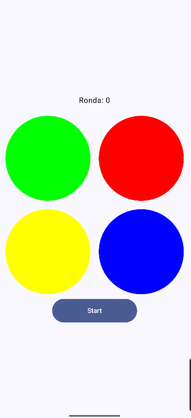
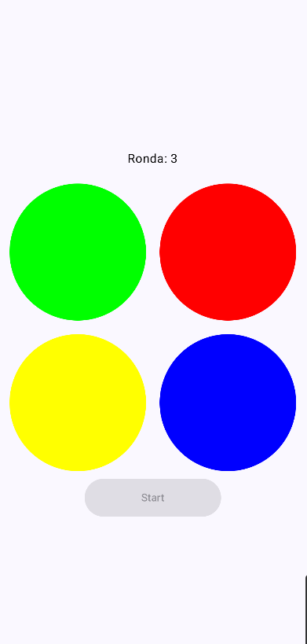
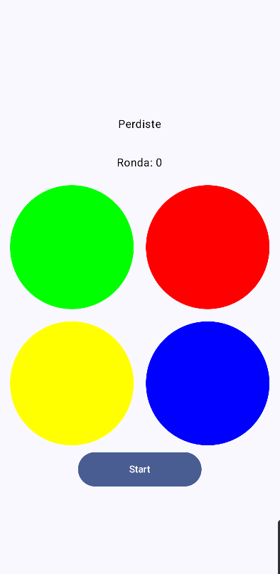

# SIMON DICE - PROYECTO ANDROID CON KOTLIN Y JETPACK COMPOSE

## INTRODUCCIÓN

Este proyecto es una recreación del clásico juego **Simón Dice**, desarrollado utilizando **Jetpack Compose** como framework para construir la interfaz gráfica. Durante su implementación, se emplearon principios de diseño como el patrón **MVVM (Model-View-ViewModel)**, el manejo de **estados**, el patrón **Observer** y se incorporaron **corrutinas de Kotlin** para gestionar operaciones asíncronas de manera eficiente.

---

## CONTENIDO

1. [ESTRUCTURA DEL PROYECTO](#estructura-del-proyecto)
2. [EXPLICACION DEL CÓDIGO](#explicacion-del-codigo)
    - [USO DEL PATRÓN MVVM](#uso-del-patron-mvvm)
    - [GESTIÓN DE ESTADOS](#gestion-de-estados)
    - [PATRÓN OBSERVER](#patron-observer)
    - [CORRUTINAS DE KOTLIN](#corrutinas-de-kotlin)
3. [FUNCIONALIDAD DEL JUEGO](#funcionalidad-del-juego)
4. [CONCLUSIÓN](#conclusion)
5. [MEJORAS FUTURAS](#mejoras-futuras)

---

## ESTRUCTURA DEL PROYECTO

El proyecto está organizado en los siguientes paquetes:

- **MainActivity.kt**: Clase principal de la aplicación donde se inicia la IU.
- **Ui.kt**: Clase que define la interfaz de usuario utilizando las funciones Composable.
- **ModelView.kt**: Contiene los métodos que implementa la clase IU, así como la lógica y el control de los estados.
- **Datos.kt**: Clase que define los datos que se utilizan en la aplicación y los almacena.

---

## EXPLICACION DEL CÓDIGO

### USO DEL PATRÓN MVVM

El patrón **MVVM** se utilizó para separar la lógica de la interfaz de usuario. En este caso, la clase **Model** se encarga de gestionar los datos de la aplicación, la clase **ModelView** se encarga de gestionar la lógica del juego, mientras que la clase **Ui** se encarga de definir la interfaz de usuario.

1. **Model**: Representado en este trabajo como un objeto **Datos**, que contiene datos compartidos como la variable **rondas**. 
2. **ViewModel**: Representado por la clase **ModelView**, que se encarga de gestionar la lógica del juego, como la generación de la secuencia de colores, la comprobación de la secuencia introducida por el usuario y el control de los estados del juego.
3. **View**: Representado por la clase **Ui**, que se encarga de definir la interfaz de usuario utilizando las funciones Composable, reacciona a los cambios en los datos.

Esta arquitectura permite una mayor flexibilidad y escalabilidad del código, facilitando la implementación de nuevas funcionalidades y la modificación de las existentes.

---

### GESTIÓN DE ESTADOS

Para gestionar los estados del juego, estos están representados por un enum class **Estados**, también tenemos que nombrar que estan gestionados con **MutableLiveData** y **mutableStateOf**, el enum class contiene los siguientes estados:


    - **INICIO**: Estado inicial del juego.
    - **GENERANDO**: Estado en el que se está generando la secuencia de colores.
    - **ADIVINANDO**: Estado en el que el usuario debe adivinar la secuencia de colores.
    - **PERDIDO**: Estado en el que el usuario ha perdido el juego.

Ejemplo de cómo se utiliza el estado en el en el VieModel:

```
estadoLiveData.value = Estados.GENERANDO
```

Los estados se utilizan para controlar el flujo del juego y determinar qué acciones se deben realizar en cada momento.

```
when (estado) {
    Estados.INICIO -> {
        // Mostrar botón de inicio
    }
    Estados.GENERANDO -> {
        // Mostrar secuencia de colores
    }
    Estados.ADIVINANDO -> {
        // Permitir al usuario adivinar la secuencia
    }
    Estados.PERDIDO -> {
        // Mostrar mensaje de derrota
    }
}
```

### PATRÓN OBSERVER

El patrón **Observer** se implementa con la clases **MutableLiveData** y las funciones **observeAsState**. Esto permite que la interfaz de usuario reaccione a los cambios en los datos y se actualice automáticamente.

Por ejemplo, el estado del juego **estadoLiveData** se observa en la función Composable principal:

```
val estado by viewModel.estadoLiveData.observeAsState(Estados.INICIO)
```

De esta forma, cualquier cambio en el estado del juego se reflejará automáticamente en la interfaz de usuario.

### CORRUTINAS DE KOTLIN

Las **corrutinas de Kotlin** se utilizan para gestionar operaciones asíncronas de manera eficiente, como la generación de la secuencia de colores y la espera del usuario para introducir la secuencia.

```
viewModelScope.launch {
            for (color in secuenciaColores) {
                mensajeC.value = color.label
                delay(500)
                mensajeC.value = ""
                delay(500)
            }
            delay(500)
            estadoLiveData.value = Estados.ADIVINANDO
            indiceActual = 0
        }
```

Esto permite que la aplicación sea más receptiva y no se bloquee mientras se realizan operaciones que requieren tiempo.

---

## FUNCIONALIDAD DEL JUEGO

El juego **Simón Dice** consiste en una secuencia de colores que se va generando aleatoriamente y que el usuario debe repetir. Cada vez que el usuario acierta la secuencia, se añade un nuevo color a la secuencia. Si el usuario se equivoca, pierde la partida.

En mi caso sigue estos pasos:

1. **Inicio**: Al iniciar la aplicación, se muestra un botón para comenzar el juego.
2. **Generando Secuncia**: Se genera una secuencia de colores que se muestra al usuario.
3. **Adivinando Secuencia**: El usuario debe introducir la secuencia de colores que ha visto.
4. **Siguiente Ronda**: Si el usuario acierta la secuencia, se añade un nuevo color a la secuencia.
5. **Perdido**: Si el usuario se equivoca, pierde la partida y se muestra un mensaje de derrota.

Imagen de la aplicación en funcionamiento:







---

## CONCLUSIÓN

El desarrollo de este proyecto me ha permitido aprender y aplicar conceptos avanzados de programación en Kotlin y Jetpack Compose, como el patrón MVVM, la gestión de estados, el patrón Observer y las corrutinas de Kotlin. Además, he adquirido experiencia en la implementación de interfaces de usuario interactivas y en la creación de juegos para dispositivos móviles.

---

## MEJORAS FUTURAS

Algunas mejoras que se podrían implementar en el futuro son:

1. **Añadir Sonidos**: Incorporar sonidos para cada color de la secuencia y para los eventos del juego.
2. **Añadir Niveles de Dificultad**: Permitir al usuario elegir entre diferentes niveles de dificultad.
3. **Añadir Puntuación**: Mostrar la puntuación del usuario y permitirle competir con otros jugadores.
4. **Añadir Animaciones**: Añadir animaciones para hacer el juego más interactivo y atractivo visualmente.
5. **Añadir Opciones de Configuración**: Permitir al usuario personalizar la apariencia y el comportamiento del juego.
6. **Añadir Modo Multijugador**: Permitir a varios jugadores competir entre sí en tiempo real.
7. **Añadir Soporte para Tabletas**: Adaptar la interfaz de usuario para que sea compatible con dispositivos de mayor tamaño.
8. **Añadir Soporte para Temas Oscuros**: Permitir al usuario elegir entre temas claros y oscuros.
9. **Añadir Soporte para Idiomas**: Permitir al usuario elegir entre diferentes idiomas para la interfaz de usuario.